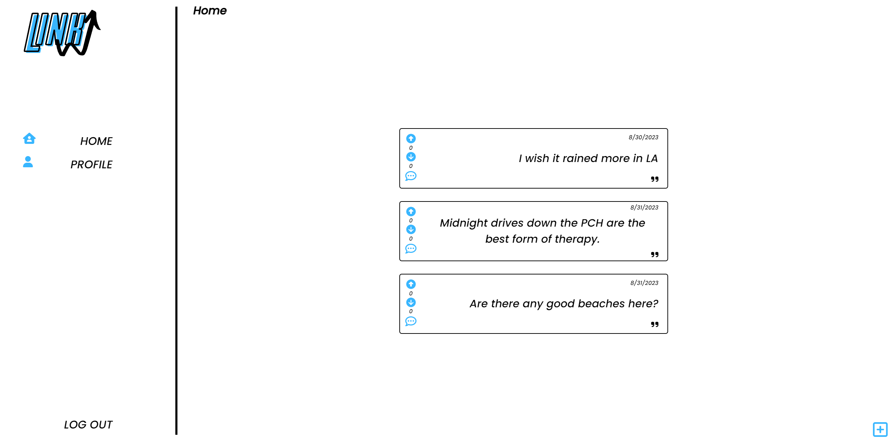
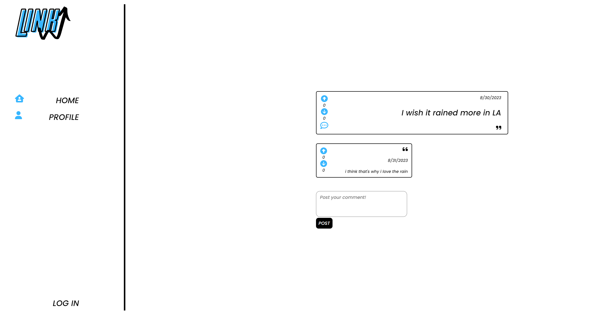
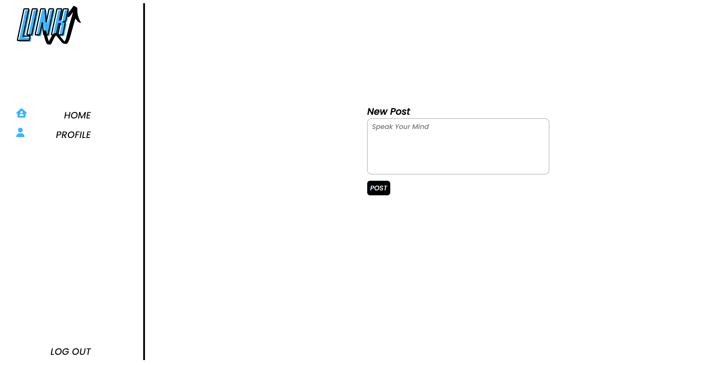
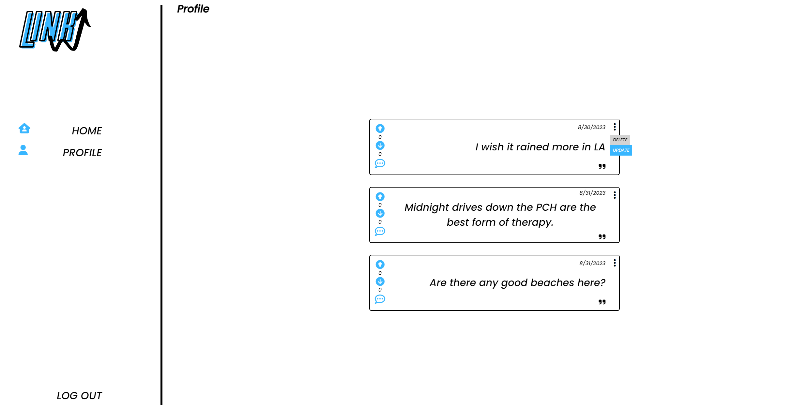

# linkUp

**linkUp** is a mimic of the application "YikYak", an application designed to create fleeting anonimous connections. This app was developed with the premise of being able to interact among people that have an existing connection, something that they already have in common. Imagine being at a party, concert, sporting event, or any big gathering or even just at school or in a new city; these are all situations where you're already connected to people you don't know because you all have something in common. Being able to interact with people and share your thoughts anonimously in these scenarios leads to a lot of fun and a lot of interesting interactions. 

## Screenshots

## Getting Started

Click [here]() to explore the application. You will need to sign in using OAuthTo in order to create posts, comments, and interact with other users. But you're still free to spectate!

## Technologies Used
**Languages:** JavaScript, HTML, CSS, Node.js, Express.js, Mongoose, MongoDB

**IDE:** VSCode

## Future Features
* location service/api: 
  the defining feature - implementing a location service that will create a scope for the posts that are displayed; i.e. set a distance for visible posts
* like/dislike features:
  be able to like and dislike posts/comments, another way of interacting with your anonimous community
* sort posts:
  have the option to sort posts by new/old/random
* refactoring code